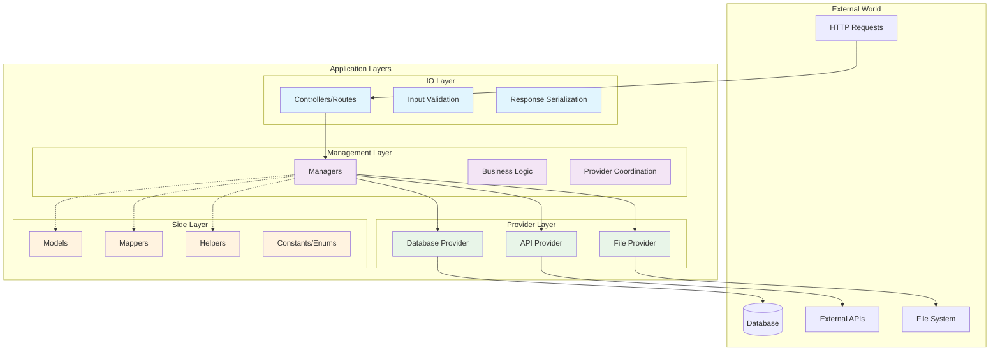

# Architecture Patterns

!!! info "Guideline Metadata"
    **Version**: 1.0.0
    **Last Modified**: 2025-01-19T00:00:00Z
    **Category**: Core Guidelines
    **Priority**: Critical

Standardized architectural patterns and implementation guidelines for all projects.

## Three-Layer Architecture

The fundamental architecture pattern used across all projects.

### Layer Overview



### Layer Responsibilities

#### IO Layer
- **Purpose**: Handle external communication
- **Responsibilities**:
  - Receive and validate input
  - Format and send responses
  - Handle authentication/authorization
  - Rate limiting and request logging

```typescript
// Example: API Controller
export class UserController {
    constructor(private userManager: UserManager) {}

    async getUser(req: Request, res: Response) {
        const { id } = this.validateGetUserRequest(req);
        const result = await this.userManager.getUserById(id);

        if (!result.success) {
            return res.status(404).json({ error: result.error });
        }

        res.json(this.formatUserResponse(result.data));
    }

    private validateGetUserRequest(req: Request): { id: string } {
        // Input validation logic
    }

    private formatUserResponse(user: User): UserResponse {
        // Response formatting logic
    }
}
```

#### Management Layer
- **Purpose**: Orchestrate business logic (ONLY when adds value)
- **When to use**:
  - Coordinating multiple providers
  - Complex business rules
  - Transaction management
  - Multi-step operations
- **When NOT to use**:
  - Simple passthrough to single provider
  - No business logic added
  - Direct CRUD operations (IO can call provider directly)

```typescript
// Example: User Manager
export class UserManager {
    constructor(
        private userProvider: UserProvider,
        private emailProvider: EmailProvider,
        private auditProvider: AuditProvider
    ) {}

    async createUser(userData: CreateUserRequest): Promise<Result<User>> {
        try {
            // Validate business rules
            const validation = this.validateUserData(userData);
            if (!validation.success) {
                return { success: false, error: validation.error };
            }

            // Coordinate multiple providers
            const user = await this.userProvider.createUser(userData);
            await this.emailProvider.sendWelcomeEmail(user.email);
            await this.auditProvider.logUserCreation(user.id);

            return { success: true, data: user };
        } catch (error) {
            return { success: false, error: error.message };
        }
    }
}
```

#### Provider Layer
- **Purpose**: Perform specific tasks
- **Responsibilities**:
  - Database operations
  - External API calls
  - File system operations
  - Cache management

```typescript
// Example: Database Provider
export class UserProvider {
    constructor(private db: Database) {}

    async getUserById(id: string): Promise<User | null> {
        const row = await this.db.query(
            'SELECT * FROM users WHERE id = $1',
            [id]
        );

        return row ? this.mapRowToUser(row) : null;
    }

    async createUser(userData: CreateUserData): Promise<User> {
        const row = await this.db.query(
            'INSERT INTO users (email, name) VALUES ($1, $2) RETURNING *',
            [userData.email, userData.name]
        );

        return this.mapRowToUser(row);
    }

    private mapRowToUser(row: DatabaseRow): User {
        return {
            id: row.id,
            email: row.email,
            name: row.name,
            createdAt: row.created_at
        };
    }
}
```

#### Side Layer
- **Purpose**: Support all layers with shared utilities
- **Components**:
  - Models (data structures)
  - Mappers (data transformation)
  - Helpers (utility functions)
  - Constants and enums

```typescript
// Models
export interface User {
    id: string;
    email: string;
    name: string;
    createdAt: Date;
}

// Mappers
export class UserMapper {
    static toDto(user: User): UserDto {
        return {
            id: user.id,
            email: user.email,
            displayName: user.name
        };
    }
}

// Helpers
export class DateHelper {
    static formatDate(date: Date): string {
        return date.toISOString().split('T')[0];
    }
}

// Constants
export const USER_CONSTANTS = {
    MAX_NAME_LENGTH: 100,
    MIN_PASSWORD_LENGTH: 8
} as const;
```

## Critical Architecture Rules

### Rule 1: Management Layer Only When Adds Value
```typescript
// ❌ WRONG: Manager just wrapping single provider
export class UserManager {
    async getUserById(id: string): Promise<Result<User>> {
        return this.userProvider.getUserById(id); // No value added!
    }
}

// ✅ CORRECT: IO calls provider directly
export class UserController {
    async getUser(req: Request, res: Response) {
        const user = await this.userProvider.getUserById(req.params.id);
        res.json(user);
    }
}

// ✅ CORRECT: Manager when coordinating multiple providers
export class UserManager {
    async createUser(userData: CreateUserRequest): Promise<Result<User>> {
        const user = await this.userProvider.createUser(userData);
        await this.emailProvider.sendWelcomeEmail(user.email);
        await this.auditProvider.logUserCreation(user.id);
        return { success: true, data: user };
    }
}
```

### Rule 2: No Provider-to-Provider Communication
```typescript
// ❌ WRONG: Providers calling each other
export class UserProvider {
    constructor(private orderProvider: OrderProvider) {} // NO!

    async deleteUser(id: string) {
        await this.orderProvider.deleteUserOrders(id); // NO!
    }
}

// ✅ CORRECT: Manager orchestrates
export class UserManager {
    constructor(
        private userProvider: UserProvider,
        private orderProvider: OrderProvider
    ) {}

    async deleteUser(id: string) {
        await this.orderProvider.deleteUserOrders(id);
        await this.userProvider.deleteUser(id);
    }
}
```

### Rule 3: "Let It Crash" Philosophy

Following Erlang's philosophy - fail fast and loud:

```typescript
// ✅ CORRECT: Trust input from upper layers
export class UserProvider {
    async createUser(userData: CreateUserData): Promise<User> {
        // No re-validation - trust management layer validated
        const result = await this.db.query(
            'INSERT INTO users (email, name) VALUES ($1, $2) RETURNING *',
            [userData.email, userData.name]
        );
        return result.rows[0];
    }
}

// ❌ WRONG: Re-validating already validated data
export class UserProvider {
    async createUser(userData: CreateUserData): Promise<User> {
        // Unnecessary - already validated in upper layer!
        if (!userData.email || !isValidEmail(userData.email)) {
            throw new Error('Invalid email');
        }
        // ...
    }
}

// ✅ CORRECT: Pass external data as-is
export class GithubProvider {
    async getUser(username: string) {
        const response = await fetch(`https://api.github.com/users/${username}`);
        return response.json(); // Return as-is, no unnecessary mapping
    }
}

// ❌ WRONG: Creating unnecessary models
export class GithubProvider {
    async getUser(username: string) {
        const response = await fetch(`https://api.github.com/users/${username}`);
        const data = await response.json();
        // Unnecessary transformation!
        return new GithubUserModel(data);
    }
}
```

### Rule 4: Minimal Data Transformation
```typescript
// ❌ WRONG: Returning raw database rows
async getUserById(id: string): Promise<DatabaseRow> {
    return this.db.query('SELECT * FROM users WHERE id = $1', [id]);
}

// ✅ CORRECT: Returning domain models
async getUserById(id: string): Promise<User | null> {
    const row = await this.db.query('SELECT * FROM users WHERE id = $1', [id]);
    return row ? this.mapRowToUser(row) : null;
}
```

### Rule 5: Error Handling at Layer Boundaries
```typescript
// Providers: Return null/throw specific errors
export class UserProvider {
    async getUserById(id: string): Promise<User | null> {
        try {
            const row = await this.db.query(/* ... */);
            return row ? this.mapRowToUser(row) : null;
        } catch (error) {
            throw new DatabaseError('Failed to fetch user', error);
        }
    }
}

// Managers: Return Result objects
export class UserManager {
    async getUserById(id: string): Promise<Result<User>> {
        try {
            const user = await this.userProvider.getUserById(id);
            return user
                ? { success: true, data: user }
                : { success: false, error: 'User not found' };
        } catch (error) {
            return { success: false, error: error.message };
        }
    }
}

// IO Layer: Convert to HTTP responses
export class UserController {
    async getUser(req: Request, res: Response) {
        const result = await this.userManager.getUserById(req.params.id);

        if (!result.success) {
            return res.status(404).json({ error: result.error });
        }

        res.json(result.data);
    }
}
```

## Common Patterns

### Result Pattern
```typescript
export interface Result<T> {
    success: boolean;
    data?: T;
    error?: string;
}

// Usage
const result = await userManager.createUser(userData);
if (result.success) {
    // Handle success
    console.log(result.data);
} else {
    // Handle error
    console.error(result.error);
}
```

### Repository Pattern (for Providers)
```typescript
export interface UserProvider {
    getUserById(id: string): Promise<User | null>;
    createUser(userData: CreateUserData): Promise<User>;
    updateUser(id: string, changes: Partial<User>): Promise<User>;
    deleteUser(id: string): Promise<void>;
}

export class DatabaseUserProvider implements UserProvider {
    // Implementation
}

export class MockUserProvider implements UserProvider {
    // Test implementation
}
```

### Factory Pattern (for Complex Creation)
```typescript
export class ServiceFactory {
    static createUserService(config: Config): UserManager {
        const userProvider = new DatabaseUserProvider(config.database);
        const emailProvider = new EmailProvider(config.email);
        const auditProvider = new AuditProvider(config.audit);

        return new UserManager(userProvider, emailProvider, auditProvider);
    }
}
```

## Project Structure Template

### Feature-Based Folder Structure (Recommended)

The primary organizational pattern groups all related files by domain/feature:

```
src/
├── features/                    # Domain-specific modules
│   ├── users/                  # User feature - all layers together
│   │   ├── user-controller.ts  # IO Layer
│   │   ├── user-routes.ts      # IO Layer
│   │   ├── user-manager.ts     # Management Layer (if needed)
│   │   ├── user-provider.ts    # Provider Layer
│   │   ├── user-model.ts       # Domain model (if needed)
│   │   ├── user-types.ts       # TypeScript types
│   │   └── user.test.ts        # Tests
│   │
│   ├── orders/                 # Order feature
│   │   ├── order-controller.ts
│   │   ├── order-manager.ts    # Complex logic needs manager
│   │   ├── order-provider.ts
│   │   ├── order-model.ts
│   │   └── order.test.ts
│   │
│   ├── payments/               # Payment feature
│   │   ├── payment-controller.ts
│   │   ├── payment-provider.ts # Simple CRUD, no manager needed
│   │   ├── payment-types.ts
│   │   └── payment.test.ts
│   │
│   └── notifications/          # Notification feature
│       ├── notification-controller.ts
│       ├── notification-manager.ts
│       ├── email-provider.ts
│       └── sms-provider.ts
│
├── shared/                     # Cross-feature utilities
│   ├── authentication/        # Auth middleware, JWT handling
│   ├── database/              # Database connection, base provider
│   ├── helpers/               # Date, crypto, validation helpers
│   ├── constants/             # App-wide constants
│   ├── types/                 # Shared TypeScript types
│   └── middleware/            # Common middleware
│
└── app.ts                      # Application entry point
```

#### Benefits of Feature-Based Structure:
- **Cohesion**: All related code in one place
- **Discoverability**: Easy to find all code for a feature
- **Isolation**: Clear boundaries between features
- **Deletability**: Remove entire feature by deleting folder
- **Scalability**: Easy to add new features
- **Team work**: Different teams can own different features

### Technology-Specific Adaptations

#### SvelteKit Project
```
src/
├── routes/               # SvelteKit routes (IO Layer)
│   ├── api/             # API routes
│   └── (app)/           # App pages
├── lib/
│   ├── features/        # Domain features
│   │   ├── users/
│   │   └── orders/
│   └── shared/          # Shared utilities
│       ├── auth/
│       └── helpers/
└── app.html
```

#### Node.js/Express API
```
src/
├── features/            # Domain features
│   ├── users/
│   ├── orders/
│   └── payments/
├── shared/              # Shared code
│   ├── auth/
│   ├── database/
│   └── middleware/
└── app.ts
```

#### C# Web API
```
ProjectName/
├── Features/           # Domain features
│   ├── Users/
│   │   ├── UsersController.cs
│   │   ├── UserManager.cs
│   │   └── UserProvider.cs
│   └── Orders/
├── Shared/             # Shared code
│   ├── Authentication/
│   └── Database/
└── Program.cs
```

## Testing Architecture

### Test Structure Mirrors Code Structure
```
src/
├── features/
│   ├── users/
│   │   ├── user-controller.ts
│   │   ├── user-provider.ts
│   │   └── user.test.ts        # Tests with feature
│   └── orders/
│       ├── order-controller.ts
│       ├── order-manager.ts
│       └── order.test.ts       # Tests with feature
tests/                          # Only for E2E/integration
├── integration/
└── e2e/
```

### Testing Each Layer
```typescript
// Provider tests (unit)
describe('UserProvider', () => {
    it('should return user when exists', async () => {
        const provider = new UserProvider(mockDatabase);
        const user = await provider.getUserById('123');
        expect(user).toEqual(expectedUser);
    });
});

// Manager tests (unit with mocked providers)
describe('UserManager', () => {
    it('should create user and send email', async () => {
        const manager = new UserManager(mockUserProvider, mockEmailProvider);
        const result = await manager.createUser(userData);
        expect(result.success).toBe(true);
        expect(mockEmailProvider.sendWelcomeEmail).toHaveBeenCalled();
    });
});

// Controller tests (integration)
describe('UserController', () => {
    it('should return 200 for valid user', async () => {
        const response = await request(app).get('/api/users/123');
        expect(response.status).toBe(200);
        expect(response.body).toEqual(expectedUserResponse);
    });
});
```

## Performance Considerations

### Database Layer Optimization
- Use connection pooling
- Implement query batching
- Add proper indexes
- Use transactions for multi-operation flows

### Caching Strategy
- Provider-level caching for external APIs
- Manager-level caching for computed results
- HTTP-level caching for static responses

### Async/Await Best Practices
```typescript
// ✅ Good: Parallel execution when possible
async function getUserWithOrders(userId: string) {
    const [user, orders] = await Promise.all([
        userProvider.getUserById(userId),
        orderProvider.getOrdersByUserId(userId)
    ]);

    return { user, orders };
}

// ❌ Bad: Sequential when parallel is possible
async function getUserWithOrders(userId: string) {
    const user = await userProvider.getUserById(userId);
    const orders = await orderProvider.getOrdersByUserId(userId);

    return { user, orders };
}
```